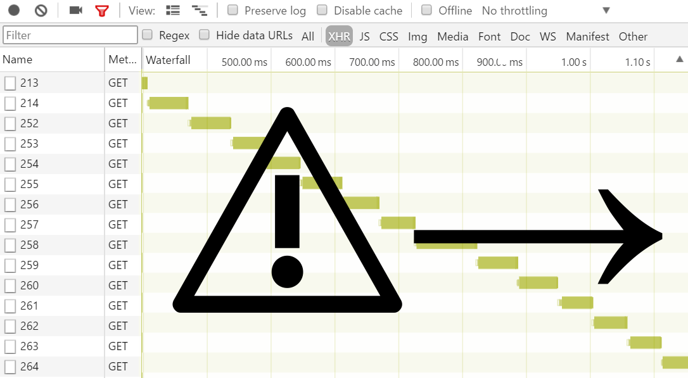

&nbsp;

# async-js-template
Speed up your website using asynchron rest calls in javascript templates

Templateengine for asynchrouneus JSON requests.

## Including into Website
Including the asjst is easy, just include this line anywhere in the header-section of the website.
`<script src="js/asjst.js"></script>`

## Compatibility

| Framework | Compatibility | Hints          |
|-----------|---------------|----------------|
| Npm jade  | Yes           | Check indention|

## Accessing via Servlet

Since Servet specification 3.0 we could access the asjst.js via java-classpath. Requirement is a [servlet-3.0](http://tomcat.apache.org/whichversion.html) container and the `web.xml`-File having at least version 3.0 like this:

```
<web-app version="3.0"> ... </web-app> 
```

Example:
## Access JSON-Values
```
   <script id="foobar" type="text/asjstOrWhatever">
      {{myFantasticField}}
   </script>
   <button onclick="
      asjst.render( 'foobar', 
              {myFantasicField:'hello'}, 
              function (htmlIncomming) {
                alert(htmlIncomming); // alerts 'hello'
              }
            );">
     Run
   </button>
   ```
## Loop

This is easy too, just like this

```
   <script id="foobar" type="text/asjstOrWhatever">
{{for peoples}}
  {{name}}
{{/for}}
   </script>
   <button onclick="
      asjst.render( 'foobar', 
              {peoples:[{name:'Mike'},{name:'Marry'}]}, 
              function (htmlIncomming) {
                alert(htmlIncomming); // alerts 'Mike Marry'
              }
            );">
     Run
   </button>
   ```
## If, else, elseif and endif
The classic If/else/endifs:
```
   <script id="foobar" type="text/asjstOrWhatever">
   {{if age <= 12}}
   Child
   {{else if age <=18}}
   Young person
   {{else if age <= 24}}
   Youngster
   {{else}}
   Adult 
   {{/if}}
   </script>
   <button onclick="
      render( 'foobar', 
              {age: 19}, 
              function (htmlIncomming) {
                alert(htmlIncomming); // alerts  'Youngster'
              }
            );">
     Run
   </button>
   ```
## Load (Async)
Loading asynchroneus requests like this:
```
   <script id="foobar" type="text/asjstOrWhatever">
{{load 'http://www.example.de/rest/abc.json'}}
  I am
  {{404}}
     missing.
  {{200}}
     available!
{{/load}}
   </script>
   <button onclick="
      asjst.render( 'foobar', 
              {}, 
              function (htmlIncomming) {
                alert(htmlIncomming); // alerts 'I am available!' on code 200 only.
              }
            );">
     Run
   </button>
   ```
## Import 

Import also works, but be warned: Its hard to debug imports because the linenumbers differ between two different script-tags. Import actually do a hard-import and linenumbers are interpreted as in the original script-tag. 

```
   <script id="head" type="text/asjstOrWhatever">
     MyHead
   </script>
   <script id="foot" type="text/asjstOrWhatever">
     MyFoot
   </script>
   <script id="main" type="text/asjstOrWhatever">
     {{import head}}
     {{import foot}}
   </script>
   <button onclick="
      asjst.render( 'main', 
              {}, 
              function (htmlIncomming) {
                alert(htmlIncomming); // alerts 'MyHead MyFoot'
              }
            );">
     Run
   </button>
   ```

## <script> Tags

| Tag      | Meaning                                                                                                                                                                                                                        | Default            | Exmaple           | More informations                                                                                                                                                                                                          |
|----------|--------------------------------------------------------------------------------------------------------------------------------------------------------------------------------------------------------------------------------|--------------------|-------------------|----------------------------------------------------------------------------------------------------------------------------------------------------------------------------------------------------------------------------|
| id       | The ID of the script-tag, must be unique.                                                                                                                                                                                      | Missing by default | id="myTemplate"   | This is HTML-Standard                                                                                                                                                                                                      |
| type     | The type of the contents, used to identify the intend of technical usage                                                                                                                                                       | Missing by default | type="text/asjst" | This is HTML-Standard, we do not special check for the value, asjst will render everything.                                                                                                                                |
| relative | For debug purpose only, while executing its possible to get a Stacktrace, this stacktrace contains linenumbers, to find the correct script-line for the error you have to declare the line, the opening-tag of the Script-Tag  | 0                  | relative="65"     | This is a special attribute and will may be marked as invalid, anyway it may not be helpfull in production-environment. The default-value is wrong in every likelihood.                                                    |
| throws   | For debug purpose only, the resulting javascript for the template is not executed and is thrown to the console to identify illegal javascript syntax.                                                                          | Missing by default | throws="sure"     | This is a special attribute and will may be marked as invalid, anyway it is prohibited in production environment. The pure existence of the attribute guides the engine to throw a exception, no matter what value it has. |

## Variables

A list of variables used by asjst helps in compatiblity-reasons, they are defined directly under the global variable ```asjst```.

| Variable Name | Meaning                                                                                      | Default value | Example                                                               | Hints                                                                                                                                                           |
|---------------|----------------------------------------------------------------------------------------------|---------------|-----------------------------------------------------------------------|-----------------------------------------------------------------------------------------------------------------------------------------------------------------|
| asjstDbg      | Debug using the console                                                                      | false         | asjstDbg=true                                                         | True means that the script parses bitchy and kill as soon as possible if something is not "perfect".                                                            |
| varlbl        | The variable-name of the buffer for the template.                                            | crdxf         | varlbl="alternate"                                                    | You must change the variable-name if a field in the json is like this name, otherwise, keep the name as it is.                                                  |
| indexVar      | The variable name of the index-variable in for-loops.                                        | index         | indexVar="alterIndex" {{for list}}   index is {{alterIndex}} {{/for}} | If a field in the list has the name "index", the fieldname is favored and the index-variable containing the index of the loop is not accessible anymore.        |
| evenVar       | The name of the variable used to identify if a loop-cycle is even and not odd.               | even          | {{for list}}  {{even?'even':'odd'}} {{/for}}                          | If a field in the list has the name "even", the fieldname is favored and the even-variable containing the value to be a even cycle is not accessible anymore.   |
| oddVar        | The name of the variable used to identify if a loop-cycle is odd and not even.               | odd           | {{for list}}  {{odd?'odd':'even'}} {{/for}}                           | If a field in the list has the name "odd", the fieldname is favored and the odd-variable containing the value to be a odd cycle is not accessible anymore.      |
| ajaxOptions   | The options to be used by default for ajax-operations.                                       | {}            | {crossDomain:true}                                                    | url, contentType, processData, dataType, error, success are set by asjst you can override the values here, but take care: to override url is not the best idea. |
| spf/epf       | The joker-marker to find replaceables (start placeholder function/ end placeholder function) | 🎸/🎻         | {{import ticktack}}🎸1🎻                                              | Every import and load will create placeholders having an index surrouded by spf/epf;                                                                            |

